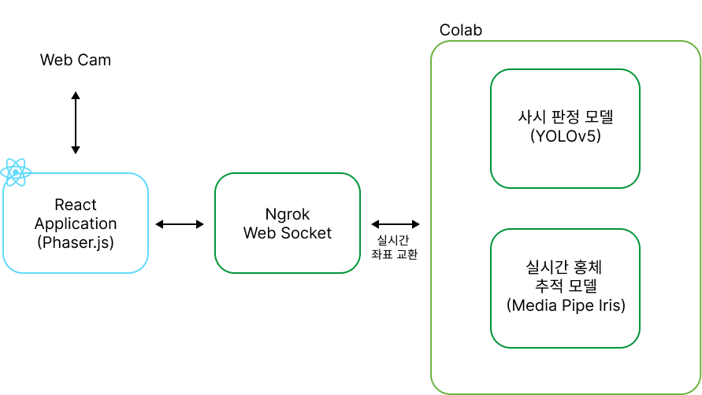
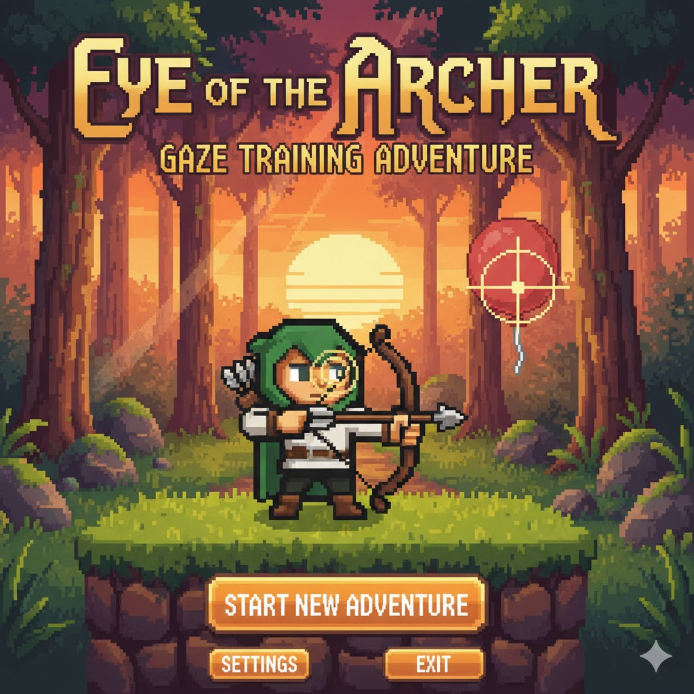

# EyeT - AI 기반 사시 진단 및 눈 훈련 게임

> 웹캠으로 사시(斜視)를 자동 진단하고, 진단 결과에 맞는 맞춤형 눈 훈련 게임을 제공하는 서비스입니다.

---

## 프로젝트 소개

**EyeT**는 AI 모델(YOLOv8)을 활용해 사용자의 눈 상태를 실시간으로 분석하고,
사시 유형에 따라 개인화된 시선 추적 훈련 게임을 제공합니다.

병원 방문 없이 웹캠만으로 사시 여부를 간단히 확인하고, 게임 형태의 재활 훈련을 할 수 있습니다.



---

## 주요 기능

### 1단계. AI 사시 진단
- 웹캠으로 10초간 얼굴을 촬영
- YOLOv8 모델이 실시간으로 눈 이미지를 분석
- 5가지 사시 유형 진단

| 진단 결과 | 설명 |
|-----------|------|
| NORMAL | 정상 |
| ESOTROPIA | 내사시 (눈이 안쪽으로 치우침) |
| EXOTROPIA | 외사시 (눈이 바깥쪽으로 치우침) |
| HYPERTROPIA | 상사시 (눈이 위쪽으로 치우침) |
| HYPOTROPIA | 하사시 (눈이 아래쪽으로 치우침) |

### 2단계. 맞춤형 눈 훈련 게임 (양궁)
- 진단 결과에 따라 훈련 방향이 달라지는 양궁 게임
- MediaPipe FaceLandmarker로 홍채 위치를 추적해 시선으로 조준
- 머리 위치 가이드라인으로 올바른 자세 유도



---

## 시스템 아키텍처

```
[웹캠] → [React 프론트엔드]
              ↕ WebSocket
         [Python 백엔드 (FastAPI)]
              ↓
         [YOLOv8 모델] → 사시 진단 결과
              ↓
         [Phaser.js 게임] ← [MediaPipe 시선 추적]
```

- **프론트엔드**: React + TypeScript + Phaser.js + Tailwind CSS
- **백엔드**: Python + FastAPI + WebSocket
- **AI 모델**: YOLOv8 (사시 분류)
- **시선 추적**: MediaPipe FaceLandmarker (홍채 랜드마크)

---

## 데이터셋 및 모델 다운로드

> `EyeT_project/` 폴더(학습 데이터셋, 모델 가중치)는 용량 문제로 저장소에 포함되지 않습니다.
> 아래 Google Drive 링크에서 다운로드 후 `EyeT_project/` 폴더에 위치시켜 주세요.

**[Google Drive 다운로드 링크](https://drive.google.com/drive/folders/1wuz0xQlqfW-sTVtbKI4viXB8fyCG0C5i?usp=drive_link)**

```
EyeT_project/
├── data/           # 학습 데이터셋 (이미지 + 라벨)
└── runs/           # 학습된 모델 가중치 (.pt)
    ├── eyet_model7/weights/best.pt   # 최종 모델
    └── ...
```

---

## 설치 및 실행

### 요구사항
- Node.js 18+
- Python 3.9+
- 웹캠

### 프론트엔드 실행

```bash
cd EyeT-game
npm install
npm run dev
```

### 백엔드 실행

```bash
pip install -r requirements.txt
python server.py
```

---

## 게임 핵심 구성


